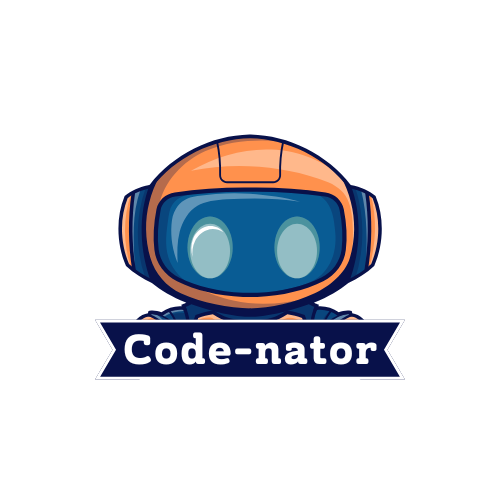
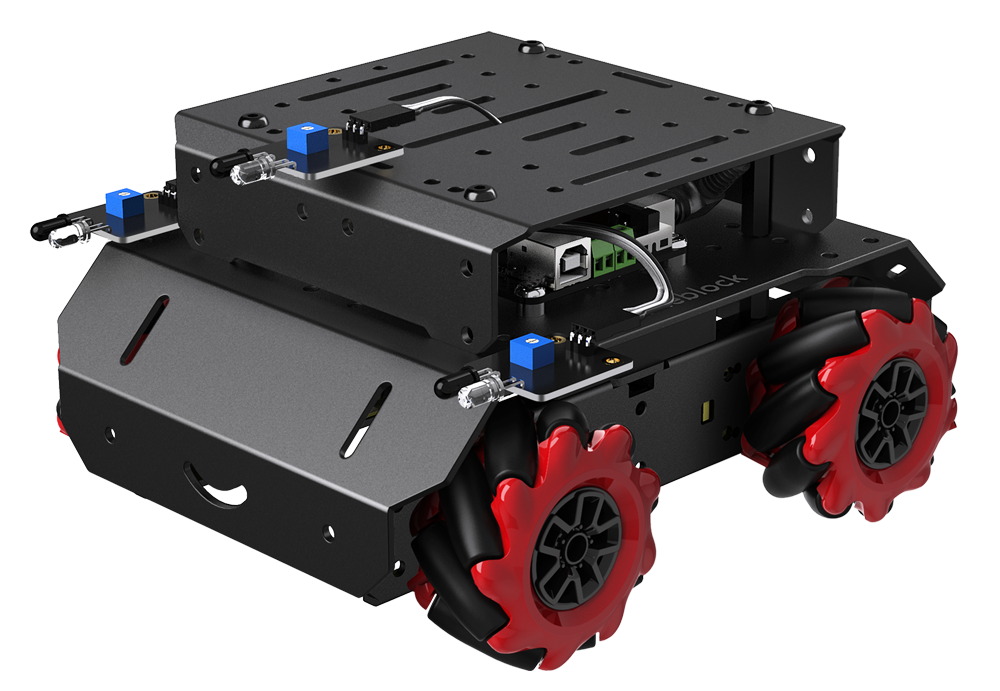

<!-- height or width of logo may be adjusted -->
<!-- This section is where you will replace the link to your transparent logo, the title of your project, and the very short desciptor of your project -->
<!-- If you used Canva to make your icon and don't want to pay for a background remover, you can use the website https://www.remove.bg/ to do so -->

  
  <h1 align="center">Using mBot to teach basic coding & debugging</h1>
  
By the Code Nators

<!-- the emojis are not set in stone! If you'd like you can remove them entirely or select your own from https://gist.github.com/rxaviers/7360908 you are welcome to -->

## :loudspeaker: About
The objective of the workshop is to use mBots to teach basic coding and debugging. This workshop has participants dissect incorrect code snippets and debug the code to perform the correct action. The students will be split up into three groups tackling the following topics: RGB Lights, Speed & Distance, and Turns/Lateral Movements. From there, students will regroup and be split into six teams to collaborate on completing a track in the fastest time.

## :bulb: Project Information
<!-- 
Your Options for target audience: 
  - High School
  - College
  - Middle School
  - K-12
  - Non-Stem
  - Undergraduate
You can select from a range of audiences or a single auidience. Examples: 
    Middle School - College 
    High School - College
    K-12
  You will be presenting most often to your peers who are taking introductory technology classes, so more often than not you should be including college in your target audience range. 
-->
* <b>Difficulty Level:</b> beginner
* <b>Target Audience:</b> middle school, college
* <b>Duration of Workshop:</b> TBD
* <b>Needed Materials:</b> tablets, mBot Mega, mBlock, cardboard maze, 
* <b>Learning Outcomes:</b> The desired outcome is to get students familiar with basic coding and debugging.
* <b>Your Main Technology</b> mBot Mega - a remote-controlled robot car that can move in all directions with its mecanum wheels and app remote control.
* [Technology Ambassador Program](https://tapggc.org/) <b>(TAP)</b> is a project-based class that provides a collaborative environment for students to work with their fellow classmates on a semester-long project using technologies of their choice. TAP strives to increase participation in IT through numerous outreach activities and workshops that are designed to showcase the creative and fun side of technology.
<!-- Commercial Video stored in the Media folder will be linked here -->

[Commercial Video](https://github.com/TAP-GGC/Code-Nator/blob/main/media/videos/mBotCommercial2.mp4)

<!-- videos can also be dragged and dropped into markdown files if you want them embedded -->

## :pencil2: Team: Code-Nator

<!-- Use the team photo of your choice once youve uploaded it to the team photo folder within the media folder -->

> (From left to right: Fredy Quintanilla, Joel Erulu, Danique Holt)
<!-- replace with full names of your team members -->

* Danique Holt
* Joel Erulu
* Fredy Quintanilla

## :mortar_board: Advisors
<!-- name of the two professors overseeing your TAP class -->
* Dr. Cengiz Gunay
* Dr. Cindy Robertson

## :page_with_curl: Project Description
Students will first observe a demo of how the code is intended to make the mBot react. They will then receive "broken code" and learn how to analyze and interpret block-based code to identify and fix errors. Through guided instruction, students will develop problem-solving skills as they work to debug the provided code snippets, ultimately getting the mBot to perform actions similar to the demo. Once the concepts are taught students will need to create their own code to complete a track.

## :memo: Publications
<!-- team members, then professors/advisors. "Name of Publication", event, month and day, year, Georgia Gwinnett College. -->
1. Team Member, Team Member, Team Member, John Doe, Jane Doe. "A Real Fake Workshop", Fake Event, April 1, 2024, Georgia Gwinnett College.  

## :open_hands: Outreach
<i>List the outreach events your team has participated in. </i>

Example:

1. <b>TAP Expo</b>, February 25, 2025, Georgia Gwinnett College: to promote the IT field and encourage college students to sign up for TAP.
2. <b>Class Workshops</b>, March 28 - April 4, 2025, Georgia Gwinnett College: to promote the IT field to non-IT students.
3. <b>GGC Super Saturday Series (S3)</b>, April 26, 2025, Georgia Gwinnett College: hands-on workshops for middle school students to learn more about technology and science.

## :mag_right: Similar Projects

If you're interested in more workshops that utilize mBots, check out [The Beep Bops](https://github.com/TAP-GGC/TheBeepBops)!

## :computer: Technology
<i> </i>
<!-- be sure to use the alt text feature in case anybody viewing your repo is using  screen reader! you want your workshop to be as accessible as possible -->

  

* [mBot](https://www.makeblock.com/pages/mbot-robot-kit/)  is an educational robot kit designed to help beginners learn programming, robotics, and electronics through hands-on activities.
* It works by allowing users to program its behavior and movements using block-based coding in mBlock software or advanced programming languages like Arduino C, enabling it to perform tasks such as obstacle avoidance, line-following, and remote control.
* As a team, we chose mBot as our technology for our project as we believe it is very interactive in teaching people how to code and letting them see how their code controls the mBot's movements.

## Project Setup/Installation 
<i> This section is dedicated to linking to .md files in your documents/tutorial/ folder that will contain instructions on installation

Your repo doesn't have to have every section used below. This is just an example so you can get an idea of what your own repo should look like</i>

### Opening a blank Scratch page 
[Click here to view instructions](/documents/tutorial%20materials/Opening%20a%20blank%20Scratch%20page.md)

[Video with Scratch instructions](https://youtu.be/v-GUbj7DMEE)

<!-- if your project uses scratch, you can reuse any of these instructions (be sure to include CS First alternatives) -->
## CS First Installation Walkthrough
[Click here to view instructions](/documents/tutorial%20materials/CS%20FIRST/CS%20First%20Walkthrough.md)

### Getting to the game 
[Click here to view instructions](/documents/tutorial%20materials/Getting%20to%20the%20Game.md)

## Usage
<i> Describe HOW to use your game. </i> 
Example: 
1. Press the Left arrow key to move to the left.
2. Press the Right arrow key to move to the right.
3. Press the Up arrow key to move up.
4. Press the Down arrow key to move down.
5. You may also replace the arrow keys with a Makey Makey. 

## Short Demo Instructions 
[Demo Video on how to install and play our game](https://youtu.be/mA80Aa55t-U)

## Workshop Instructions 
[Click here to view workshop walkthrough pdf file](/documents/tutorial%20materials/Scratch%20Workshop%20Walkthrough.pdf)

[Our Game Workshop Video](https://youtu.be/Mtsre0iMStM)

